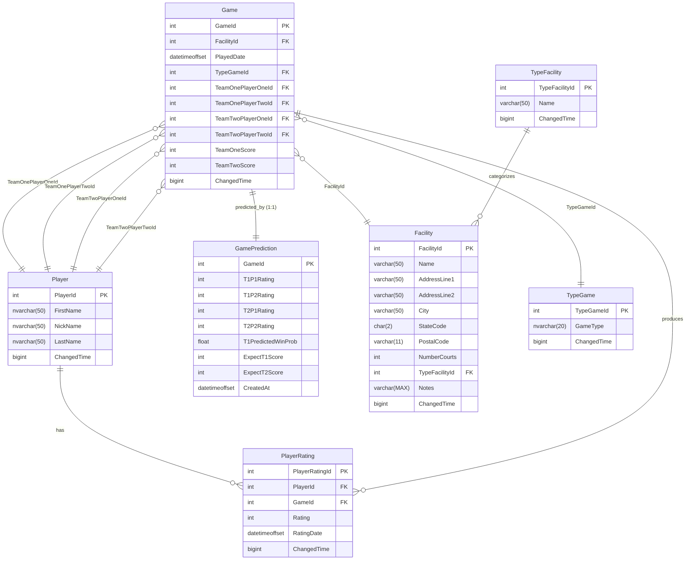

# VitasPickleballRating
Pickleball Rating system for use by Vitas players.
1. It keeps track of players, and games played.
1. It estimates the score of a game between two teams.
1. It computes a new rating for each player after a game.
1. It displays win-loss standings of player and their rating.
1. It displays a players rating over time.

## Getting Started
There are two ways to setup the database for development.
1. Use a localdb SQL Server instance.
1. use a dockerized SQL Server instance.

For production deployment a azure SQL database instance is used.

__NOTE:__ 
If docker builds are hanging in Windows environment, the workaround is to use
the WSL2 Ubuntu environment to run the commands


In all case the first step is to build the DACPAC.

From the solution folder run:
```sh
dotnet build vpr/vpr.sqlproj
```

### Setup tool

The tool used to deploy is `sqlpackage.exe` which is part of the
Microsoft/sqlpackage tool.
Install Microsoft/sqlpackage tool:
```sh
dotnet tool install --global microsoft.sqlpackage
```


Setup the Entity Framework Tools. The sqlproj should already have the
**Microsoft.EntityFrameworkCore.Design** package reference. If not add it, by
cd'ing to the vpr folder and running:
```sh
dotnet add package Microsoft.EntityFrameworkCore.Design
```
then install the tool:
```sh

dotnet tool install --global dotnet-ef
```

Next deploy the DACPAC to your preferred dev database server.

### Using localdb SQL Server instance
To use a localdb SQL Server instance, ensure you have localdb installed. This
is part of the Visual Studio installation.
One can check using the VS __SQL Server Object Explorer__ window.
Create the database `vpr` on the localdb instance `(localdb)\ProjectModels`.

```sh
sqlpackage.exe /Action:Publish /SourceFile:"vpr\bin\Debug\vpr.dacpac" /TargetServerName:"(localdb)\ProjectModels" /TargetDatabaseName:vpr /TargetTrustServerCertificate:True /p:CreateNewDatabase=True

```
__NOTE:__ the create new database parameter. Data is not preserved. This
primarily for testing.

### Using dockerized SQL Server instance
Start the mssql server container

``` sh
docker run -e "ACCEPT_EULA=Y" -e "MSSQL_SA_PASSWORD=YourStrong?Password" -e "MSSQL_PID=Express" -p 1433:1433 -d mcr.microsoft.com/mssql/server:2022-latest

```
Deploy the dacpac

Run the following command to deploy the dacpac to the mssql server container
running on localhost:

``` cmd
sqlpackage.exe /Action:Publish /SourceFile:"vpr\bin\Debug\vpr.dacpac" /TargetServerName:localhost /TargetDatabaseName:vpr /TargetTrustServerCertificate:True /TargetUser:sa /TargetPassword:"YourStrong?Password" /p:CreateNewDatabase=True

```
Create Logins and Users using SSMS. TODO: figure how to script this. doing it
in the dacpac does not appear to work. ssms does some stuff behind the scenes.

### Application update
When changing the Database schema, you will need to regenerate the EF model.
To regenerate the EF model from the database, run the following command in the
Package Manager Console:
```
Scaffold-DbContext -Connection "Server=(localdb)\ProjectModels;Database=vpr;Integrated Security=True;" Microsoft.EntityFrameworkCore.SqlServer -NoOnConfiguring -Force -OutputDir Models

```
or from the bash command line in the solution folder:
```bash
 dotnet ef dbcontext scaffold "Server=localhost;Database=vpr;User Id=sa;Password="YourStrong?Password";TrustServerCertificate=True"  Microsoft.EntityFrameworkCore.SqlServer --no-onconfiguring --force --output-dir Models --project PickleBallAPI/PickleBallAPI.csproj
 
 ```

Next remove Redundant Navigational properties.
1. `DbSet<GamePrediction>`
1. GameDetail and `DbSet<GameDetail>` and mapping.
1. TypeGame.Games
1. TypeFacility.Facilities
1. Player.TeamXPlayerY (4 of them)
1. PlayerRating.Game
1. Game.PlayerRating
1. Facility.TypeFacility
1. Facility.Games


*__NOTE:__*
To convert a visual Studio SSDT database project to a SDK project suitable for
dotnet core follow instruction 
[Here](https://learn.microsoft.com/en-us/sql/tools/sql-database-projects/howto/convert-original-sql-project?view=sql-server-ver17&pivots=sq1-visual-studio).
You will not be able to build or publish using Visual Studio after converting.
The above commandline methods will work locally and in a pipeline.

#### To build the Docker Image
From the solution folder run:
``` sh
docker build -f PickleBallAPI/Dockerfile -t api:latest --build-arg BUILD_CONFIGURATION=Debug .

```
#### To run the application
``` sh
docker run -d -e ASPNET_ENVIRONMENT=Development -p 8080:8080 api

```
### Warning
To get the 'Generate Code Map to work, deploy vpr to (localdb)\MSSQLlocalDB.

### Database Schema
The Schema is shown [Here](./VPR_Schema.png)



## Building

## ToDo
- integrate dotnet-tsqlt test runner and tsqlt testing framework
- Add unit tests for Views and table checks constraints
