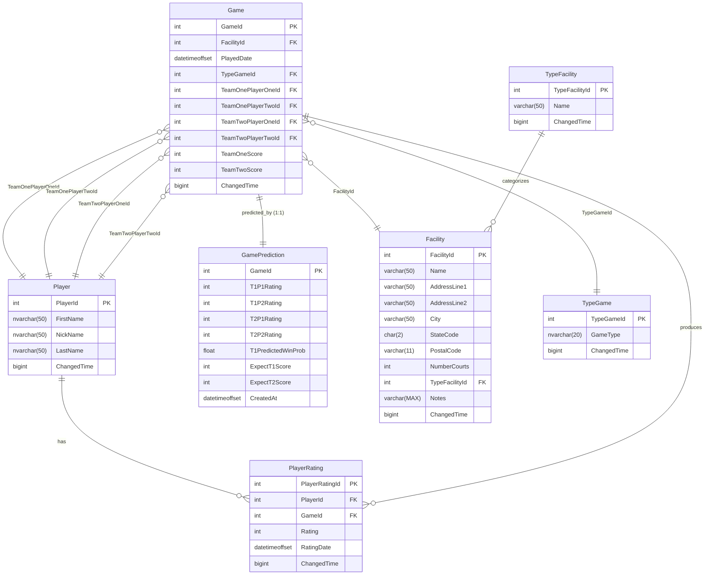

# VitasPickleballRating

A Pickleball Rating system for use by Vitas players.

- Tracks players and games played
- Estimates the outcome of a game between two teams using an Elo-based algorithm
- Computes a new rating for each player after a game
- Displays win-loss standings of players and their ratings
- Displays a player's rating over time

## Technology Stack

- **Backend:** ASP.NET Core 8 Web API (C#)
- **ORM:** Entity Framework Core (SQL Server)
- **Database:** Microsoft SQL Server (localdb, Docker, or Azure SQL)
- **Database Project:** SDK-style SQL project (`.sqlproj`)
- **Mapping:** AutoMapper
- **API Documentation:** Swagger / OpenAPI
- **CI/CD:** Azure Pipelines → Azure Container Registry
- **Testing:** MSTest

## Prerequisites

- [.NET 8 SDK](https://dotnet.microsoft.com/download/dotnet/8)
- [Docker](https://www.docker.com/) (optional – for running a containerized SQL Server or the API itself)
- [sqlpackage](https://learn.microsoft.com/en-us/sql/tools/sqlpackage/sqlpackage) – installed via `dotnet tool install --global microsoft.sqlpackage`
- [dotnet-ef](https://learn.microsoft.com/en-us/ef/core/cli/dotnet) – installed via `dotnet tool install --global dotnet-ef`
- SQL Server Management Studio (SSMS) or Azure Data Studio (optional – for managing the database)

> **Windows note:** If Docker builds hang, run the commands from a WSL2 Ubuntu shell.

## Getting Started

There are two ways to set up the database for development:
1. Use a **localdb** SQL Server instance (Windows / Visual Studio)
2. Use a **Dockerized** SQL Server instance (cross-platform)

For production, an Azure SQL Database instance is used.

### 1. Build the DACPAC

From the solution folder run:

```sh
dotnet build vpr/vpr.sqlproj
```

### 2. Install Required Tools

```sh
dotnet tool install --global microsoft.sqlpackage
dotnet tool install --global dotnet-ef
```

### 3. Deploy the Database

#### Option A – localdb (Windows / Visual Studio)

Ensure localdb is installed (included with Visual Studio). Verify using the **SQL Server Object Explorer** window.

```sh
sqlpackage.exe /Action:Publish /SourceFile:"vpr\bin\Debug\vpr.dacpac" /TargetServerName:"(localdb)\ProjectModels" /TargetDatabaseName:vpr /TargetTrustServerCertificate:True /p:CreateNewDatabase=True
```

> **Note:** `CreateNewDatabase=True` drops and recreates the database. Existing data will be lost.

#### Option B – Dockerized SQL Server

Start the SQL Server container:

```sh
docker run -e "ACCEPT_EULA=Y" -e "MSSQL_SA_PASSWORD=YourStrong?Password" -e "MSSQL_PID=Express" -p 1433:1433 -d mcr.microsoft.com/mssql/server:2022-latest
```

Deploy the DACPAC:

```sh
sqlpackage.exe /Action:Publish /SourceFile:"vpr\bin\Debug\vpr.dacpac" /TargetServerName:localhost /TargetDatabaseName:vpr /TargetTrustServerCertificate:True /TargetUser:sa /TargetPassword:"YourStrong?Password" /p:CreateNewDatabase=True
```

After deploying, create the required logins and users using SSMS or Azure Data Studio.

### 4. Configure the Connection String

Update `PickleBallAPI/appsettings.Development.json` with the appropriate connection string for your environment:

```json
{
  "ConnectionStrings": {
    "vpr": "Server=(localdb)\\ProjectModels;Database=vpr;Integrated Security=True;Encrypt=False;Trust Server Certificate=True;"
  }
}
```

### 5. Run the API

```sh
dotnet run --project PickleBallAPI/PickleBallAPI.csproj
```

The Swagger UI is available at `http://localhost:<port>/swagger` when running in the Development environment.

## Docker

### Build the Docker Image

From the solution folder:

```sh
docker build -f PickleBallAPI/Dockerfile -t api:latest --build-arg BUILD_CONFIGURATION=Debug .
```

### Run the Containerized API

```sh
docker run -d -e ASPNET_ENVIRONMENT=Development -p 8080:8080 api
```

## API Endpoints

| Method | Route | Description |
|--------|-------|-------------|
| `GET` | `/api/Games` | List all games |
| `GET` | `/api/Games/{id}` | Get a game by ID |
| `GET` | `/api/Games/export/raw` | Export all games as a CSV file |
| `POST` | `/api/Games` | Create a new game |
| `PUT` | `/api/Games/{id}` | Update an existing game |
| `PUT` | `/api/Games/{id}/update` | Recalculate prediction and ratings for a single game |
| `PUT` | `/api/Games/update` | Rebuild all game predictions and player ratings |
| `GET` | `/api/Player` | List all players |
| `GET` | `/api/Player/{id}` | Get a player by ID |
| `GET` | `/api/Player/export/raw` | Export all players as a CSV file |
| `GET` | `/api/Player/{playerId}/PlayerRatings` | Get ratings for a player |
| `GET` | `/api/Player/{playerId}/PlayerRatings/LatestBefore/{date}` | Get the latest rating for a player before a given date |
| `POST` | `/api/Player` | Create a new player |
| `PUT` | `/api/Player/{id}` | Update an existing player |
| `GET` | `/api/PlayerRatings` | List all player ratings |
| `GET` | `/api/PlayerRatings/{id}` | Get a player rating by ID |
| `POST` | `/api/PlayerRatings` | Create a player rating |
| `PUT` | `/api/PlayerRatings/{id}` | Update a player rating |
| `DELETE` | `/api/PlayerRatings/{id}` | Delete a player rating |

## Testing

Run the unit and integration tests from the solution folder:

```sh
dotnet test
```

Tests are located in the `TestPickleBallApi` project and cover controllers, game logic, ELO calculations, and AutoMapper profiles.

## Database Schema

The schema diagram is shown [here](./VPR_Schema.png).



## Development Notes

### Updating the EF Core Model

When the database schema changes, regenerate the EF Core model.

**From the Visual Studio Package Manager Console:**

```powershell
Scaffold-DbContext -Connection "Server=(localdb)\ProjectModels;Database=vpr;Integrated Security=True;" Microsoft.EntityFrameworkCore.SqlServer -NoOnConfiguring -Force -OutputDir Models
```

**From the command line (solution folder):**

```bash
dotnet ef dbcontext scaffold "Server=localhost;Database=vpr;User Id=sa;Password=YourStrong?Password;TrustServerCertificate=True" Microsoft.EntityFrameworkCore.SqlServer --no-onconfiguring --force --output-dir Models --project PickleBallAPI/PickleBallAPI.csproj
```

After scaffolding, remove the following redundant navigation properties:
- `DbSet<GamePrediction>`
- `GameDetail`, `DbSet<GameDetail>`, and its mapping
- `TypeGame.Games`
- `TypeFacility.Facilities`
- `Player.TeamXPlayerY` (4 properties)
- `PlayerRating.Game`
- `Game.PlayerRating`
- `Facility.TypeFacility`
- `Facility.Games`

### Converting the SQL Project

To convert a Visual Studio SSDT database project to an SDK-style project suitable for .NET Core, follow the instructions [here](https://learn.microsoft.com/en-us/sql/tools/sql-database-projects/howto/convert-original-sql-project?view=sql-server-ver17&pivots=sq1-visual-studio).

> **Note:** After converting, the project can no longer be built or published using Visual Studio. Use the command-line methods described above.

### Code Map

To get **Generate Code Map** to work, deploy `vpr` to `(localdb)\MSSQLlocalDB`.

## Contributing

1. Fork the repository.
2. Create a feature branch: `git checkout -b feature/my-feature`
3. Make your changes and add tests where appropriate.
4. Commit your changes: `git commit -m "Add my feature"`
5. Push to your fork: `git push origin feature/my-feature`
6. Open a Pull Request.

## To Do

- Integrate `dotnet-tsqlt` test runner and tsqlt testing framework
- Add unit tests for Views and table check constraints
- Refine the ELO K-factor based on number of games played and game type (recreational vs. tournament)
